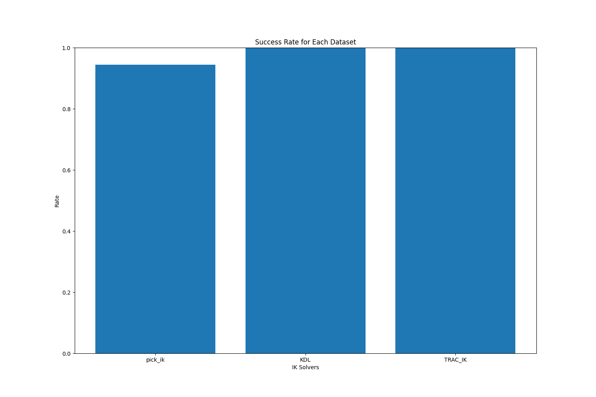
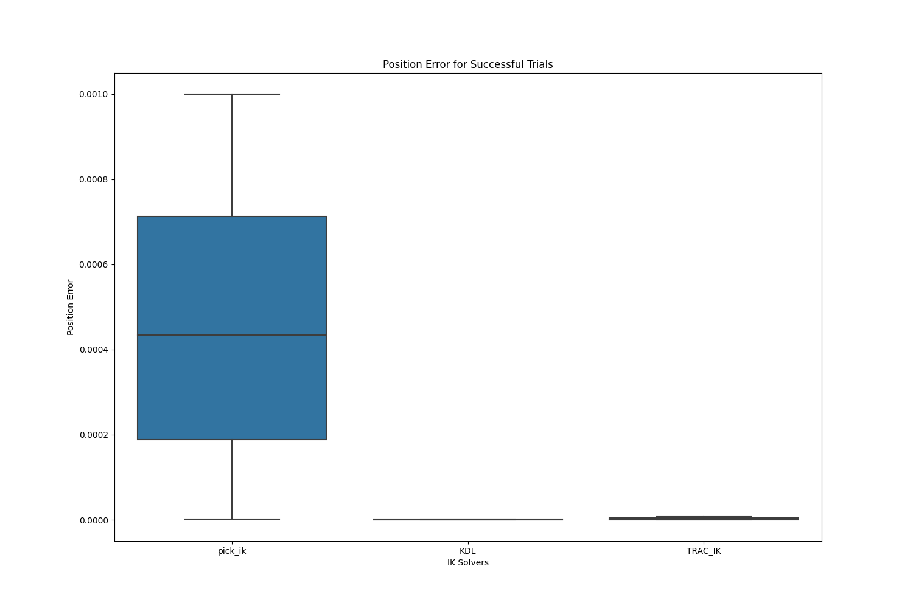
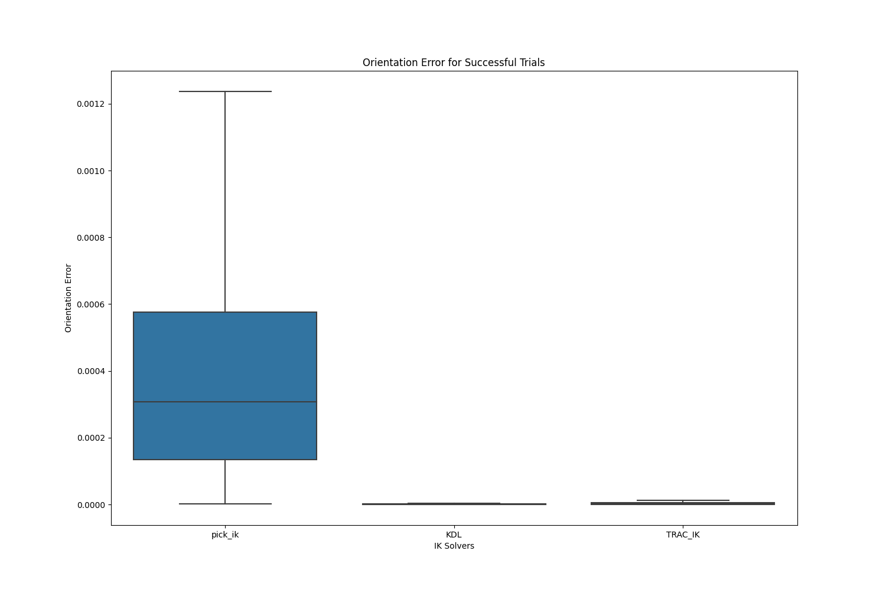
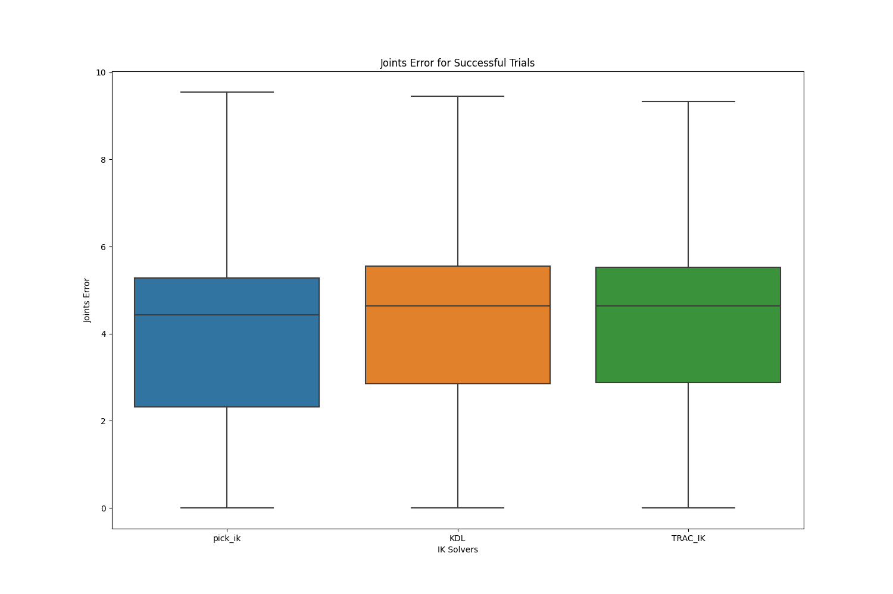

# MoveIt Inverse Kinematics Benchmarking

## Introduction

Inverse Kinematics (IK) serves as a foundational element in robotic systems,
facilitating purposeful interactions with the surrounding environment.
It empowers robots to achieve specific poses and reach target locations with precision.
Despite the importance of IK solvers in robotic planning and control,
choosing the right one can be a complex decision.
Different IK solvers offer unique strengths and weaknesses,
raising the need to conduct a performance evaluation for specific use-cases.

This `ik_benchmarking` package utilizes ROS 2 and MoveIt 2 to offer a suite of
benchmarking utilities designed to aid the evaluation of IK solvers.
This tutorial is crafted to walk you through the installing the package,
configuring IK solvers for benchmarking, running the necessary scripts for
data collection and visualization of the results for easier analysis.

In addition, the architectural components of the package are outlined with
key classes that enable its functionality. Towards the end, we discuss potential future improvements,
ensuring that the package remains aligned with emerging needs and technologies.


## Installation

In the following steps, the `ik_benchmarking` is assumed to be installed in
the `ws_moveit2` workspace as it is closely connect with MoveIt 2,
but feel free to use your own workspace. The default example of `ik_benchmarking`
uses `KDL`, `pick_ik`, and `TRAC_IK` solvers.


1. **Clone the repository and its dependencies**
    ```bash
    cd ~/ws_moveit2/src
    git clone https://github.com/Robotawi/ik_benchmarking.git
    vcs import ik_benchmarking/.repos
    ```

2. **Build the ik_benchmarking and IK solvers packages as follows**
    ```bash
    cd ~/ws_moveit2
    colcon build --packages-select ik_benchmarking pick_ik trac_ik --symlink-install
    ```
    If you made a fresh workspace, build the whole workspace
    ```bash
    colcon build --symlink-install
    ```
Note: Including the `--symlink-install` flag is advantageous as it allows you
to make changes to the package files without requiring a complete rebuild of the workspace.
This applies only to files that are interpreted at run time, like YAML, Python scripts, etc.


3. **Source the Workspace**
    ```bash
    source install/setup.bash
    ```

With these steps completed, we are now set to dive into the configuration of the
IK solvers for benchmarking purposes.


## Usage

### Configuration via `ik_benchmarking.yaml`

Before initiating the benchmarking process, ensure that the `ik_benchmarking.yaml`
configuration file is tailored according to your needs. This file allows users to
define various settings such as the MoveIt configuration package to load the robot model,
the planning group for the robot pre-defined within the MoveIt configuration package,
the sample size, and the IK solvers intended for testing.

Below is a breakdown of the default example configuration file's structure:

```yaml
moveit_config_pkg: moveit_resources_panda_moveit_config
robot_name: panda
planning_group: panda_arm
sample_size: 10000

ik_solvers:
  - name: KDL
    kinematics_file: kdl_kinematics.yaml

  - name: TRAC_IK
    kinematics_file: trac_ik_kinematics.yaml

  - name: pick_ik
    kinematics_file: pick_ik_kinematics.yaml
```

#### Key Components

- `moveit_config_pkg`: Specifies the MoveIt configuration package for the robot arm you are benchmarking.
For example, `moveit_resources_panda_moveit_config` is used for the Panda robot arm.
By convention, the MoveIt configuration packages are named `robot_moveit_config` or
`moveit_resources_robot_moveit_config`. Your robot's MoveIt config package should follow this convention.

- `robot_name`: The name of the robot model to be used in the benchmarking process.

- `planning_group`: Indicates the name of the planning group that you wish to
use for benchmarking IK solvers. In the example, the planning group is `panda_arm`.

- `sample_size`: Specifies the number of samples the benchmarking will run.
For instance, setting it to `10000` means that each IK solver will be tested 10,000 times.

#### IK Solvers

The `ik_solvers` section presents the list of solvers to be benchmarked:

- `name`: Represents the name of the IK solver you wish to benchmark,
such as `KDL`, `TRAC_IK`, `pick_ik`, or other solvers.
- `kinematics_file`: Specifies the YAML file containing the solver's kinematic configuration.
This file is conventionally located within the `config` directory of the robot's MoveIt configuration package.

Appropriately configuring the `ik_benchmarking.yaml` enables users to select specific IK solvers
for a comprehensive benchmarking experience.

### Running the benchmarking

#### The `ik_benchmarking_data_generator.py` script

After configuring the `ik_benchmarking.yaml` file,
the next step is to execute the benchmarking script, `ik_benchmarking_data_generator.py` which is
included as a node inside the `ik_benchmarking` package.
This Python script serves as a convenient way to automate the process of launching the IK solver benchmarking tests.

#### Script Overview

Here is a link to the [ik_benchmarking_data_generator.py](./scripts/ik_benchmarking_data_generator.py) script.
The script is designed to dynamically read the `ik_benchmarking.yaml` configuration file,
and construct the launch commands for the different IK solvers.

#### Key Components

- `load_benchmarking_config()` function reads the `ik_benchmarking.yaml` configuration file for
the `ik_benchmarking` package. It retrieves the names of all the IK solvers specified in the
configuration file and returns them as a list of strings.

- `ik_solver_names` is a list contains the names of the IK solvers as specified in the configuration file.

- `launch_commands` is a dynamically generated list of ROS 2 launch commands, tailored based on the
names of the available IK solvers in the `ik_solver_names`. Each command in this list
includes a solver name as an argument. This argument directs the benchmarking process to utilize
a specific IK solver for generating performance data.

- `subprocess` module is used to execute each entry in the `launch_commands`,
launching the benchmarking process for the respective IK solvers.

#### How to Run

To execute the script, make sure you completed the installation step and **sourced** your workspace.
The package generates output files in **the current working directory** from which the script is executed.
Run the following command to generate IK solving data for benchmarking process:

```bash
cd ~/ws_moveit2 #cd into your ROS 2 workspace
source install/setup.bash
ros2 run ik_benchmarking ik_benchmarking_data_generator.py
```

The data generator script will begin collecting benchmarking data and save the
details in a CSV file for each solver in **the current working directory**.
The files will be named `<solver_name>_ik_benchmarking_data.csv`,
with the `solver_name` retrieved from the `ik_benchmarking.yaml` config file.

#### Generated Data

While the Inverse Kinematics is being solved, several types of data are collected to
understand the performance and accuracy of the IK solver being evaluated.

**Solve Time:** is the time taken to find an IK solution, measured in microseconds.

**Solve Rate:** is the percentage of the successful trials to the total IK solution trials.

**Position Error:** After finding the IK solution, the function calculates the position error by
comparing the robot tip link position from both the forward and inverse kinematics processes.

**Orientation Error:** Similarly, an orientation error is calculated by determining the angle between
robot tip link orientation from forward and inverse kinematics.

**Joint Error:** This is calculated as the Euclidean distance between the sampled joint values used to
calculated forward kinematics and the joint values resulting from the inverse kinematics solution.

Note: The command at the start of this section generates the files in the directory `~/ws_moveit2`.
The setting of the desirable output directory for the data generator script is under development.

### Visualizing the Benchmarking Data

#### The `ik_benchmarking_data_visualizer.py` script

Once you have generated the benchmarking data using the `ik_benchmarking_data_generator.py` script,
you can utilize the `ik_benchmarking_data_visualizer.py` script for visualization.
This script, is also a node within the `ik_benchmarking` package, facilitates the visualization of IK solver performance,
offering insights into their strengths and weaknesses.

#### Script Overview

Access the [ik_benchmarking_data_visualizer.py](./scripts/ik_benchmarking_data_visualizer.py) script here.
The script reads the previously generated CSV files, processes the data, and visualizes key performance metrics using plots.

#### Key Components

- `read_ik_benchmarking_files()`: This function is responsible for reading the benchmarking data from CSV files.
It processes the data and prepares it for visualization.

- `plot_data()`: This function is responsible for plotting the data. It creates box plots for solve times,
position, orientation, and joint errors, as well as bar charts for success rates.

#### How to Run

To visualize the benchmarking data, ensure your workspace is sourced and use the `ik_benchmarking_data_visualizer.py` script.
By default, the script looks for data files in the current working directory. Run it as follows:

```bash
ros2 run ik_benchmarking ik_benchmarking_data_visualizer.py
```

However, if your data files reside in a different directory, specify the path using:

```bash
ros2 run ik_benchmarking ik_benchmarking_data_visualizer.py --ros-args -p data_directory:=<path to the directory containing data files>
```

This script reads the benchmarking data and displays a series of plots, providing an insight of the performance of the specified IK solvers.

#### Visualization Output

The script offers a series of visualizations, with examples shown from the default example, which compares `KDL`, `pick_ik`, and `TRAC_IK` solvers.

1. **Solve Times**: Box plots showcasing the time taken by each solver to find IK solutions.

<p align="center">
  
</p>


2. **Success Rates**: Bar charts illustrating the rate of successful IK solutions for each solver.

<p align="center">
  
</p>

3. **Position, Orientation, and Joint Errors**: Box plots that highlight the differences between the sampled and computed results for each IK solver.

<p align="center">
  
  
  
</p>


These visualizations aim at providing side-by-side comparison of different IK solvers, allowing you to make informed decisions about which solver best meets your application requirements.

### Using Cyclone DDS


**Note:** To ensure smooth operation of the IK Benchmarking, configure ROS 2 to use Cyclone DDS
as the default DDS middleware. If it's not already configured, follow these steps:

- Install Cyclone DDS for your ROS 2 distribution.

```bash
sudo apt install ros-${ROS_DISTRO}-rmw-cyclonedds-cpp
```

- Set up the necessary environment variables

```bash
echo "export RMW_IMPLEMENTATION=rmw_cyclonedds_cpp" >> ~/.bashrc
```

- Start new terminal session.
