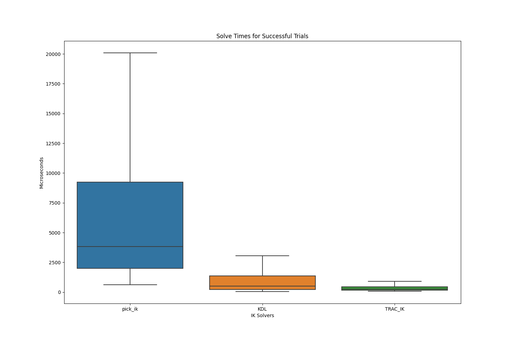

# IK Solvers Benchmarking using ROS2 and MoveIt2

## Introduction

Inverse Kinematics (IK) serves as a foundational element in robotic systems, 
facilitating purposeful interactions with the surrounding environment. 
It empowers robots to achieve specific poses and reach target locations with precision. 
Despite the importance of IK solvers in robotic planning and control, 
choosing the right one can be a complex decision. 
Different IK solvers offer unique strengths and weaknesses, 
raising the need to conduct a performance evaluation for specific use-cases.

This `ik_benchmarking` package utilizes ROS 2 and MoveIt 2 to offer a suite of 
benchmarking utilities designed to aid the evaluation of IK solvers. 
This tutorial is crafted to walk you through the installing the package, 
configuring IK solvers for benchmarking, running the necessary scripts for 
data collection and visualization of the results for easier analysis. 

In addition, the architectural components of the package are outlined with 
key classes that enable its functionality. Towards the end, we discuss potential future improvements, ensuring that the package remains aligned with emerging needs and technologies.


## Installation 

In the following steps, the `ik_benchmarking` is assumed to be installed in 
the `ws_moveit2` workspace as it is closely connect with MoveIt 2, 
but feel free to use your own workspace.


1. **Clone the repository**
    ```bash
    cd ~/ws_moveit2/src
    git clone https://github.com/Robotawi/ik_benchmarking.git
    ```

2. **Build the package as follows**
    ```bash
    cd ~/ws_moveit2
    colcon build --packages-select ik_benchmarking --symlink-install
    ```
    If you made a fresh workspace, build the whole workspace
    ```bash
    colcon build --symlink-install
    ```
Note: Including the `--symlink-install` flag is advantageous as it allows you 
to make changes to the package files without requiring a complete rebuild of the workspace. 
This applies only to files that are interpreted at run time, like YAML, Python scripts, etc. 


3. **Source the Workspace**
    ```bash
    source install/setup.bash
    ```

With these steps completed, we are now set to dive into the configuration of the 
IK solvers for benchmarking purposes.


## Usage 

### Configuration via `ik_benchmarking.yaml`

Before running any benchmarking, it is crucial to set up the `ik_benchmarking.yaml` configuration file according to your needs. 
This file allows you to specify various settings like the MoveIt configuration package to load the robot model from, move group of the robot that is pre-defined inside 
the MoveIt configuration package, sample size, and the IK solvers you wish to test. 
Below is an explanation of each key-value pair in the configuration file:

```yaml
moveit_config_pkg: moveit_resources_panda_moveit_config
move_group: panda_arm
sample_size: 10000

ik_solvers:
  1:
    name: KDL
    kinematics_file: kdl_kinematics.yaml
  2:
    name: TRAC_IK
    kinematics_file: trac_ik_kinematics.yaml
  3:
    name: pick_ik
    kinematics_file: pick_ik_kinematics.yaml
```

#### Key Components

- `moveit_config_pkg`: Specifies the MoveIt configuration package for the robot arm you are benchmarking. 
For example, `moveit_resources_panda_moveit_config` is used for the Panda robot arm. 
By convention, the MoveIt configuration packes are named `robot_moveit_config` or 
`moveit_resources_robot_moveit_config`. Your robot's MoveIt config package should follow this conveniton. 

- `move_group`: Indicates the name of the move group that you wish to benchmark. In the example, the move group is `panda_arm`.

- `sample_size`: Specifies the number of samples the benchmarking will run. 
For instance, setting it to `10000` means that each IK solver will be tested 10,000 times.

#### IK Solvers

The `ik_solvers` section is an indexed list of solvers to benchmark:

- The numeric keys (e.g., `1`, `2`, `3`) are used to identify the IK solvers. 
The actual numerical value has no specific significance but should be unique for each solver. 
The numbering starts from `1` and there is no limit on the number of solvers to be used to 
collect IK solving data in a single benchmarking run. 
Make sure each solver has a key in the list and the following `name` and `kinematics_file`.

- `name`: The name of the IK solver you are benchmarking, such as `KDL`, `TRAC_IK`, or `pick_ik`.

- `kinematics_file`: The YAML file that holds the solver's kinematic configuration. 
This YAML file, by convention, exists in the `config` directory of the robot's MoveIt configuration package.

By configuring the `ik_benchmarking.yaml` file appropriately, you can control which IK solvers to benchmark, allowing for a comprehensive evaluation.

### Running the benchmarking 

#### The `ik_benchmarking_data_generator.py` script

After configuring the `ik_benchmarking.yaml` file, 
the next step is to execute the benchmarking script, `ik_benchmarking_data_generator.py` which is
included as a node inside the `ik_benchmarking` package. 
This Python script serves as a convenient way to automate the process of launching the IK solver benchmarking tests.

#### Script Overview

Below is the content of the `ik_benchmarking_data_generator.py` script:

```python
#!/usr/bin/env python3

import subprocess

def main():
    # Assume the ik_benchmarking package is inside ws_moveit2 workspace
    source_command = "source /home/$USER/ws_moveit2/install/setup.bash"

    # Commands to run ik benchmarking with different IK solvers
    launch_commands = [
        "ros2 launch ik_benchmarking start_ik_benchmarking.launch.py ik_solver_number:=1",
        "ros2 launch ik_benchmarking start_ik_benchmarking.launch.py ik_solver_number:=2",
        "ros2 launch ik_benchmarking start_ik_benchmarking.launch.py ik_solver_number:=3"
    ]

    for command in launch_commands:
        full_command = f"{source_command} && {command}"
        process = subprocess.Popen(
            full_command, shell=True, executable="/bin/bash")

        # Wait for completion or timeout after 30 seconds to run next command
        try:
            process.communicate(timeout=30)
        except subprocess.TimeoutExpired:
            process.kill()

if __name__ == "__main__":
    main()
```

#### Key Components

- `source_command`: This command sources the workspace where the `ik_benchmarking` package is located.
The script assumes that this workspace is `ws_moveit2`. 
Adapt this to the name of your workspace if it is different.

- `launch_commands`: A list of ROS 2 launch commands that start the benchmarking process for each
 IK solver, defined by the argument `ik_solver_number`. 
 This `ik_solver number` corresponds to the identifiers mentioned above in the `ik_benchmarking.yaml` file. 
 For example, the three lines in the script generate data for the three solvers with identifiers `1`, `2`, and `3`.

- The `subprocess` module is used to execute each command, 
launching the benchmarking process for the respective IK solvers.

- To avoid a faulty process from blocking the benchmarking process, 
every process times out after 30 seconds, if it does not close cleanly.

#### How to Run

To execute the script, make sure you completed the installation step and sourced the workspace. 
The package generates output files in the current working directry in which it is executed. 
Run the following command to generate IK solving data for benchmarking process:

```bash
cd ~/ws_moveit2
ros2 run ik_benchmarking ik_benchmarking_data_generator.py
```

This will automatically start the benchmarking tests for the IK solvers specified in your `ik_benchmarking.yaml` configuration file. 

Note: Ensure you have the necessary permissions to run the script. You might need to run `chmod +x ik_benchmarking_data_generator.py` to make the script executable.

#### Generated Data 

While the Inverse Kinematics is being solved, several types of data are collected to 
understand the performance and accuracy of the IK solver being evaluated. 

**Solve Time:** is the time taken to find an IK solution, measured in microseconds.

**Solve Rate:** is the percentage of the successful trials to the total IK solution trials. 

**Position Error:** After finding the IK solution, the function calculates the position error by
comparing the robot tip link position from both the forwad and inverse kinematics processes.

**Orientation Error:** Similarly, an orientation error is calculated by determining the angle between
robot tip link orientation from forward and inverse kinematics.

**Joint Error:** This is calculated as the Euclidean distance between the sampled joint values used to
calculated forward kinematics and the joint values resulting from the inverse kinematics solution.

The data generator script saves these details in a CSV file for each solver. 
The files are named by `<solver_name>_ik_benchmarking_data.csv`, 
while the `solver_name` is loaded from the `ik_benchmarking.yaml` config file.

Note: The command at the start of this section generates the files in the directory `~/ws_moveit2`.
The setting of the desirable output directory is to be implemented soon.

#### Visualization 


This point is expecting improvements for more convenience setting of the output directory 
that hosts the generated CSV files. However, for the purpose of testing, please copy the script
responsible for plotting the generated data from inside the `ik_benchmarking` package and run it as follows.

```bash
# Copy the script to the workspace
cd ~/ws_moveit2
cp src/ik_benchmarking/scripts/ik_benchmarking_data_visualizer.py .

# Run the script on the generated data 
python3 ik_benchmarking_data_visualizer.py 

```

The script loads files that end with the suffix `_ik_benchmarking_data.csv` and plots the data from them. 
Solve times are visualized with box plots, solve rates with bar charts, 
and the different types of errors are illustrated with scatter plots. 
